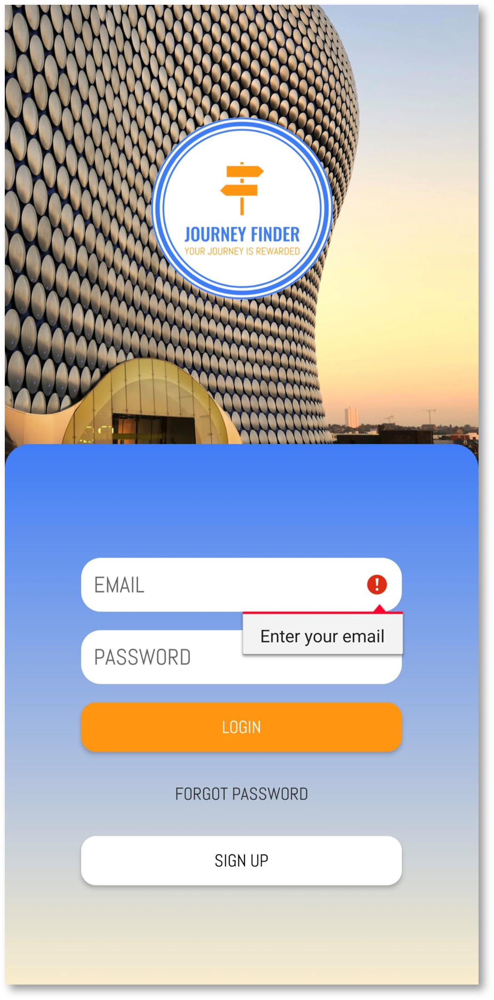
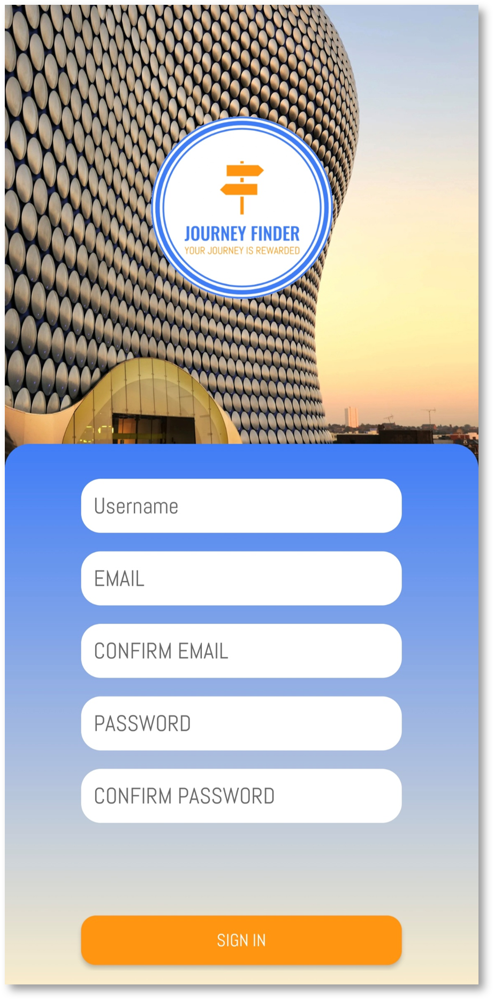
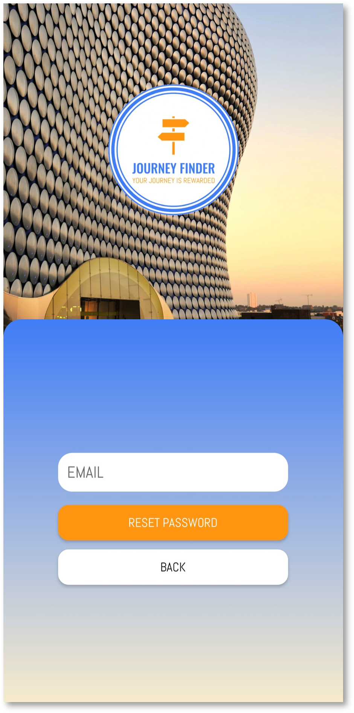
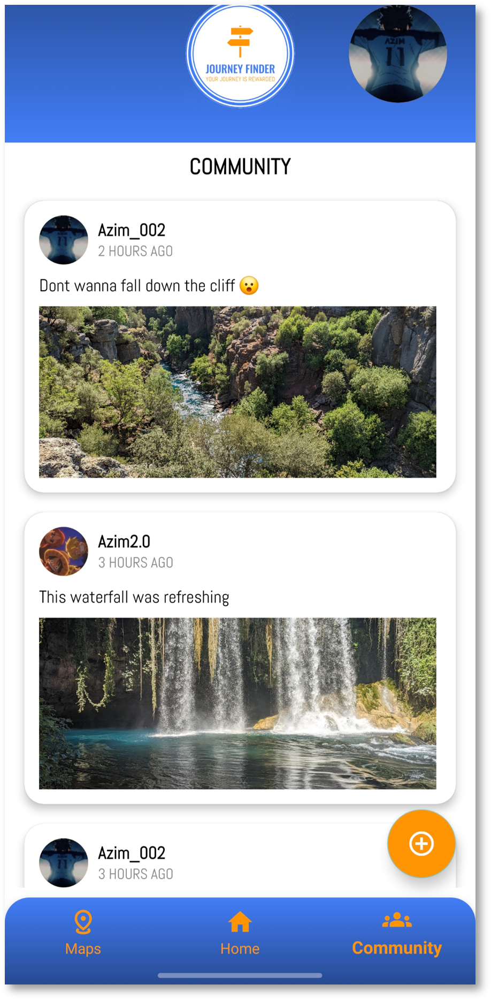
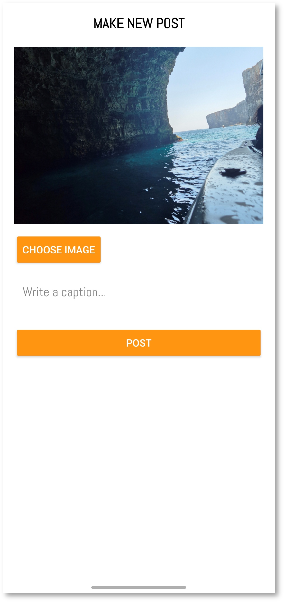
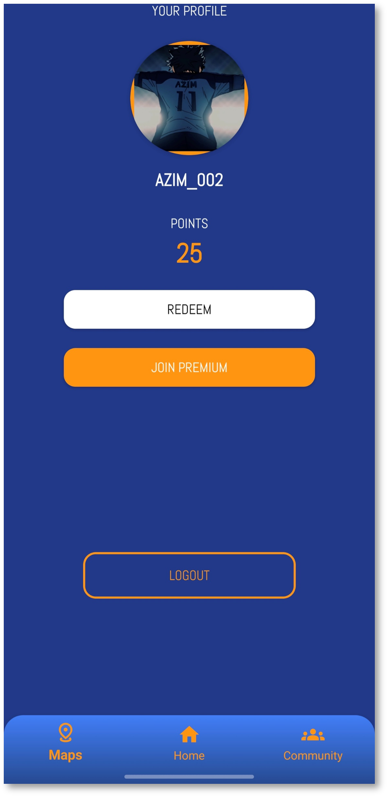
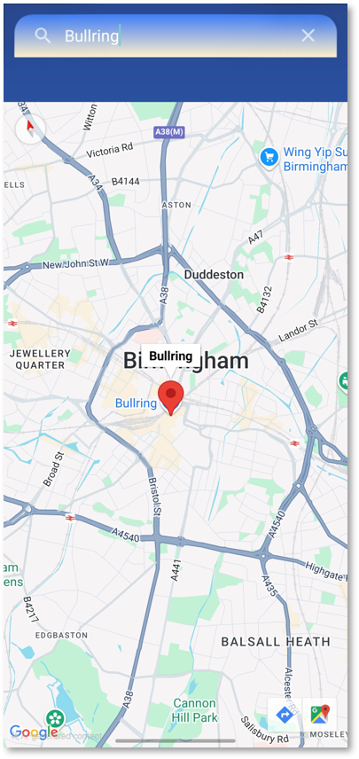

# JourneyFinder Android App 

  

Journey Finder is more than just a maps app, it’s a platform for the modern travelers and even small business owners. Built with a focus on User-Centric Design, the application bridges the gap between static navigation and real time community sharing. 
By integrating the Google Maps SDK with a Firebase real time backend, users can post location-specific "Discoveries" that help others find authentic experiences.

To run add your own google-services.json file to /app folder and API keys to local.properties

# Why
Traditional travel and navigation apps are often get you from point A to point B, but they lack the the exploration of local discovery. Travelers frequently miss out on authentic "hidden gems" because they rely online lists. Furthermore.
Journey Finder bridges the gap between static navigation and real time community sharing, so it can be like other social media apps out there (Twitter also known as X).

- Real Time Community Feed: Powered by Firebase, users can post "Discoveries" that appear instantly for others in the area, turning the map into a living social platform.
- Accessibility-First UI: Journey Finder features a high-contrast interface specifically tested and optimized for Deuteranopia (Red-Green color blindness).
- User Centric: Developed through a rigorous UCD process, moving from Figma wireframes to Maze usability testing to ensure the interface is intuitive for travelers on the move.

# Figma High Fidelity Link
[Figma Design](https://www.figma.com/proto/ucBppxYKnkH4W2RkWEXQIr/Hi-Fi-App?node-id=107-250&p=f&t=lszLGM7TfUa79Wyu-1&scaling=scale-down&content-scaling=fixed&page-id=0%3A1)

# Frontend Development
- Language: Java
- UI Architecture: XML Layouts with a focus on design components.
- Mapping: Google Maps SDK for Android (Real time location tracking).
- Dependency Management: Gradle Kotlin DSL.

# Backend & Data
- Firebase Authentication: Secure user sign in and profile management.
- Firebase Firestore: NoSQL cloud database for real time community posts.
- Google Places API: Integration for searching and verifying local landmarks.
- 
#Design & Research (UCD)
- Figma: Hi-Fi prototyping and interactive wireframing.
- Maze: Quantitative usability testing and heatmapping to validate the UI.
- Accessibility Testing: Color contrast validation and Deuteranopia simulation filters.

# Images

  
  
  
  
   
   
   
   

# All Documentation for this project.
* [Implementation Report](docs/JourneyFinder-UXdesign-Report.pdf)
* [UX/UI Design Case Study](docs/My-Journey-Finder-AS-Report.pdf)
