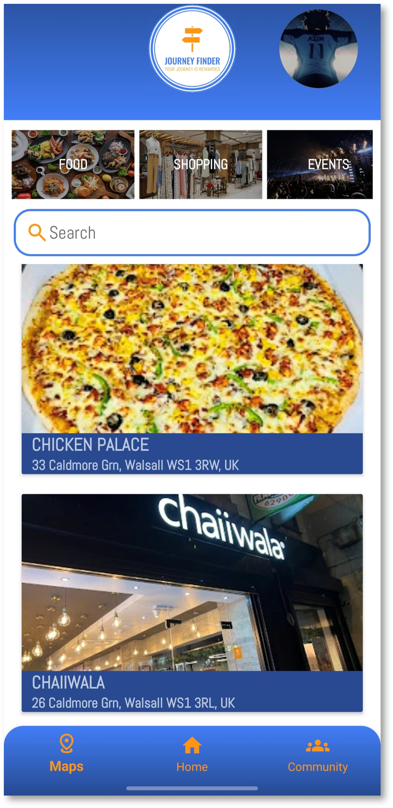

# JourneyFinder Android App 

  

Journey Finder is more than just a maps app, it’s a platform for the modern travelers and even small business owners. Built with a focus on User-Centric Design, the application bridges the gap between static navigation and real time community sharing. 
By integrating the Google Maps SDK with a Firebase real time backend, users can post location-specific "Discoveries" that help others find authentic experiences.

# Images

  
  
  
  
   
   
   
   

# All Documentation for this project.
* [Implementation Report](docs/JourneyFinder-UXdesign-Report.pdf)
* [UX/UI Design Case Study](docs/My-Journey-Finder-AS-Report.pdf)
